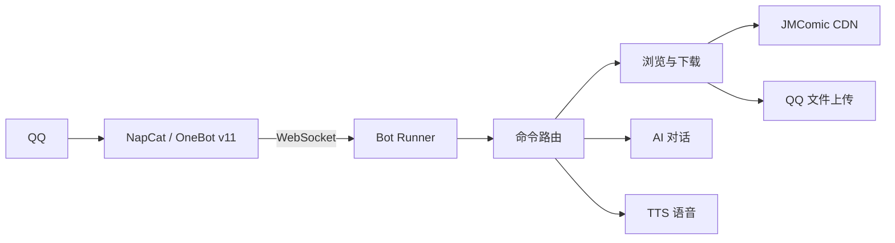

<div align="center">

# 🐾 JM Bot v2

### 模块化的 QQ 漫画助手

搜索 · 推荐 · 下载 · AI 对话 · 语音回复

[](https://www.python.org/)
[](https://onebot.dev/)
[](https://www.microsoft.com/windows)
[](#测试)

一个轻量、可自托管的 QQ Bot：把 JMComic 的浏览与下载能力接入 NapCat，配合可选的 AI 和 TTS 服务完成自然交互。

</div>

---

## ✨ 功能

| | 能力 | 入口 |
|:--:|---|---|
| 🔎 | 搜索、详情、排行、分类、随机推荐 | `/jm search` · `/jm info` · `/jm rank` |
| 📚 | 单本 / 批量下载，PDF / ZIP 导出 | `/jm download` |
| 📈 | 进度通知、队列、停止、缓存清理 | `/jm queue` · `/jm stop` |
| 🤖 | AI 意图识别、漫画工具调用、会话历史 | `/jm ask` |
| 🎭 | 7 种角色口吻，按群保存 | `/jm role` |
| 🔊 | Vocu / 硅基流动 TTS，失败自动回退文字 | `/jm voice` |
| 🛡️ | 超时、重连、卡死检测、消息节流 | 自动生效 |

## 🧭 工作方式



Bot 只处理 `/jm` 开头的消息。AI、TTS 和外部网络均为可选项；未配置密钥时，搜索、详情和下载仍可使用。

## 🚀 30 秒启动

### 1. 准备

- Windows 10/11
- Python 3.14
- 已登录并启用 OneBot v11 的 NapCat
- 可访问 JMComic CDN 的网络环境

### 2. 安装

```powershell
cd jm_bot_v2
python -m venv .venv
.\.venv\Scripts\python.exe -m pip install -r requirements.txt
Copy-Item config.example.json config.json
```

编辑 `config.json`，确认 NapCat 地址和 `access_token`：

```json
{
  "napcat": {
    "http_url": "http://127.0.0.1:3002",
    "ws_url": "ws://127.0.0.1:3001",
    "access_token": "填入你的 token"
  }
}
```

### 3. 启动

```powershell
.\.venv\Scripts\python.exe main.py
```

也可以双击 `jm_bot_v2/start.bat`。日志出现 `已连接 NapCat WebSocket` 后，在测试群发送：

```text
/jm help
```

AI 使用环境变量覆盖配置：

```powershell
$env:ANTHROPIC_AUTH_TOKEN = "你的 API Key"
$env:ANTHROPIC_BASE_URL = "https://api.deepseek.com/anthropic"
$env:ANTHROPIC_DEFAULT_HAIKU_MODEL = "服务商支持的模型名"
```

## 💬 命令速查

<details>
<summary>展开全部命令</summary>

| 命令 | 说明 |
|---|---|
| `/jm help` | 查看帮助 |
| `/jm search <关键词>` | 搜索漫画 |
| `/jm info <ID>` | 查看详情 |
| `/jm rank [day\|week\|month]` | 查看排行榜 |
| `/jm category <标签>` | 按标签筛选 |
| `/jm random [--top\|--best\|--new]` | 随机推荐 |
| `/jm random --tag <标签>` | 按标签推荐 |
| `/jm <ID>` | 下载 PDF（简写） |
| `/jm download <ID> [pdf\|zip]` | 指定格式下载 |
| `/jm download <ID1> <ID2>` | 批量下载 |
| `/jm queue` | 查看队列与进度 |
| `/jm stop` | 停止下载 |
| `/jm cache` | 查看缓存占用 |
| `/jm cache clean [天数]` | 清理旧缓存，默认 7 天 |
| `/jm ask <内容>` | AI 对话 |
| `/jm ask clear` | 清空会话历史 |
| `/jm role [编号]` | 查看 / 切换角色 |
| `/jm voice [on\|off\|status]` | 设置 / 查看语音 |
| `/jm restart` | 软重启 Bot |

</details>

## 🔊 开启语音

在 `config.json` 的 `tts` 段填写引擎和密钥，再把 `tts_voices.json` 中的占位音色 ID 换成自己的值：

```text
/jm voice on       开启本群 AI 语音
/jm voice off      关闭本群 AI 语音
/jm voice status   查看状态
```

语音只作用于 AI 纯聊天；搜索、详情、下载进度和错误消息仍发送文字。合成或发送失败时自动回退文字。使用语音前请确保 `ffmpeg` 在 PATH 中。

## 📁 目录

```text
jm_bot_v2/
├─ main.py                 # 启动入口
├─ config.example.json     # 脱敏配置模板
├─ config.json             # 本机配置，不提交
├─ option.yml              # JMComic 配置
├─ requirements.txt        # 依赖
├─ start.bat               # Windows 启动脚本
├─ bot/
│  ├─ runner.py            # WS 连接与自动重连
│  ├─ router.py            # 命令路由
│  ├─ handlers/            # 浏览、下载、聊天、杂项
│  ├─ downloader.py        # 下载与 PDF / ZIP
│  ├─ ai_chat.py / tts.py  # AI / TTS
│  ├─ napcat.py            # OneBot HTTP API
│  └─ roles.py / antiban.py # 角色与节流
└─ tests/test_all.py       # 离线测试
```

## ⚙️ 关键配置

| 配置 | 默认值 | 用途 |
|---|---:|---|
| NapCat HTTP / WS | `3002` / `3001` | 发消息、上传文件、接收事件 |
| 同群 / 全局冷却 | `15s` / `20s` | 降低重复请求 |
| 首图超时 | `300s` | 下载卡死保护 |
| 磁盘预警 / 临界 | `500MB` / `100MB` | 防止磁盘耗尽 |
| AI 限频 | `10 条 / 分钟` | 控制模型调用 |

完整配置说明见 [`docs/V2.md`](docs/V2.md)。

## 🧪 测试

测试不启动 WebSocket，不调用真实 AI、TTS 或下载服务：

```powershell
cd jm_bot_v2
python tests/test_all.py
```

当前结果：**265 PASS · 0 FAIL**。

## 🧯 常见排查

- **没有回复**：确认 NapCat 已登录、端口和 token 一致，并检查 `bot.log`。
- **WS 不断重连**：确认 OneBot v11 正向 WS 已开启，且只启动一个 Bot 实例。
- **下载超时**：检查网络、`option.yml` 域名、证书和磁盘空间。
- **AI 不可用**：检查 `ANTHROPIC_*` 环境变量，修改后重启进程。
- **语音回退文字**：检查 TTS key、音色 ID 和 `ffmpeg`。

## 🔐 安全边界

请勿提交以下内容：

```text
config.json · API Key · NapCat token · QQ 登录二维码
chat_history.json · group_roles.json · 下载文件 · TTS 缓存
```

漫画、音频和第三方 API 按使用者自己的授权与服务条款使用。本仓库当前未声明独立开源许可证。

## 📖 文档

- [V2 运行与开发说明](docs/V2.md)
- [V2 模块说明](jm_bot_v2/README.md)

<div align="center">

Made for QQ · Built with Python

</div>
